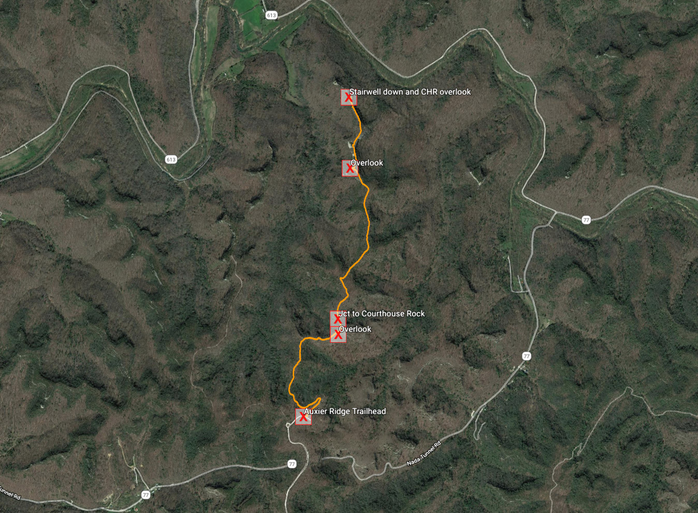
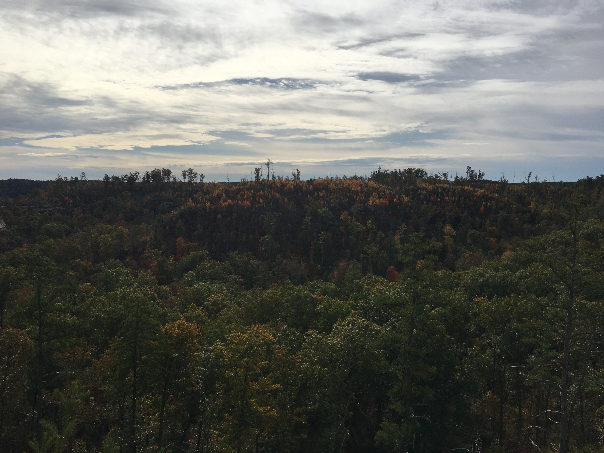
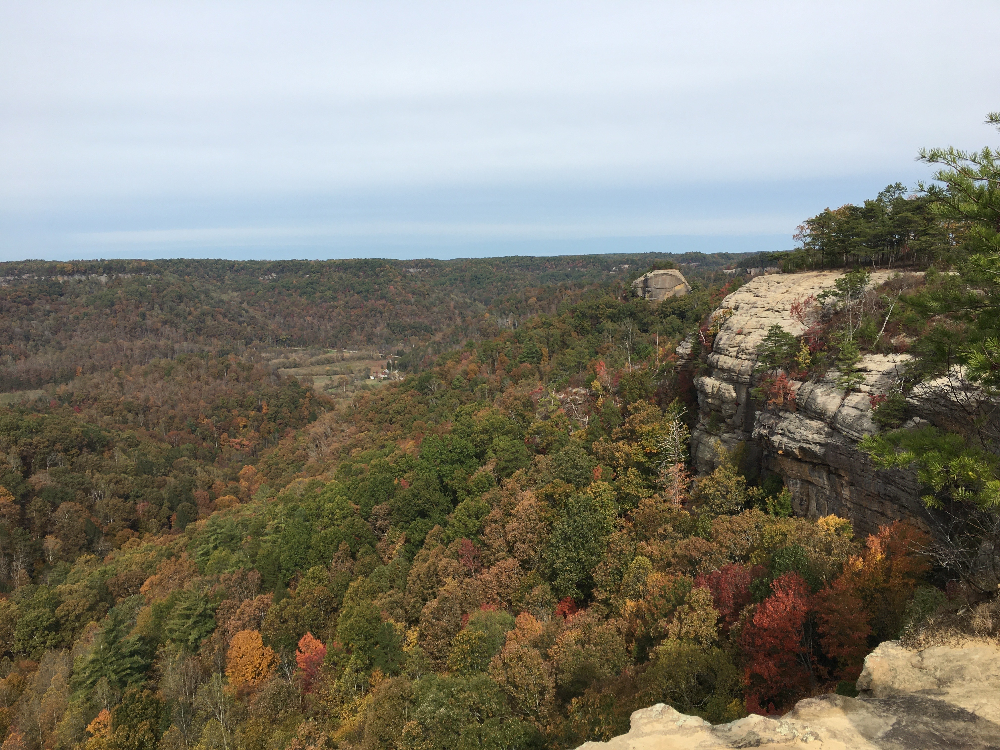
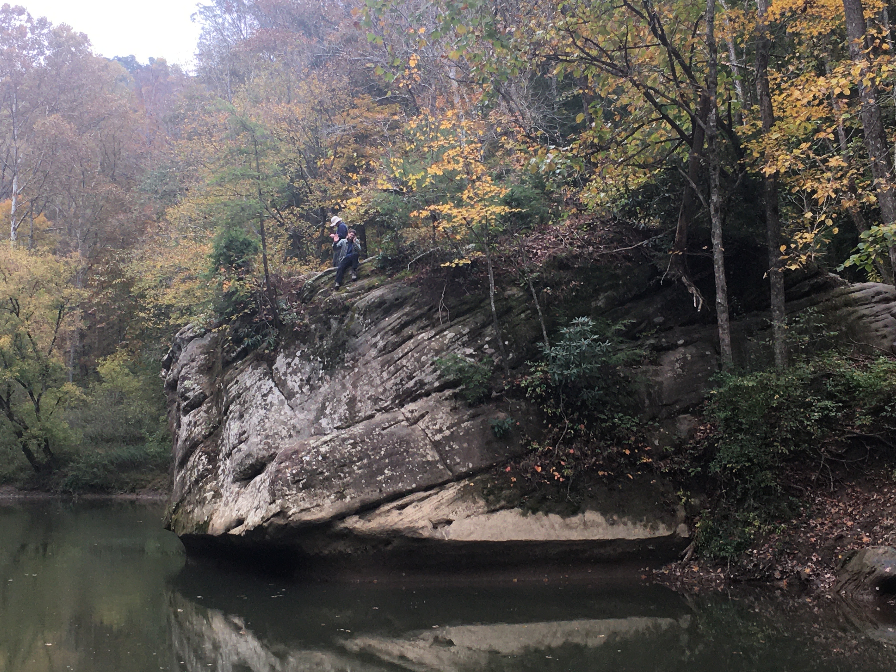

# Auxier Ridge Trail Data
## Collected 10/25/2019
### Data 
* Trail Data Download: [ZIP](https://alexgis-projects.github.io/rrg/trail-data/rrg-trail-data.zip)
* [Basemap](https://alexgis-projects.github.io/rrg/trail-data/rrg-avenza-basemap.pdf) used in [Avenza Maps](https://apps.apple.com/app/apple-store/id388424049) for orientation. GPS data gathered using an iPhone 6s.

    
*KML viewed in Google Earth*

### Images from GPS data collection

    
*Stairwell down and Courthouse Rock overlook*

    
*Outlook*

    
*Overlook*

    
*Jump Rock*
